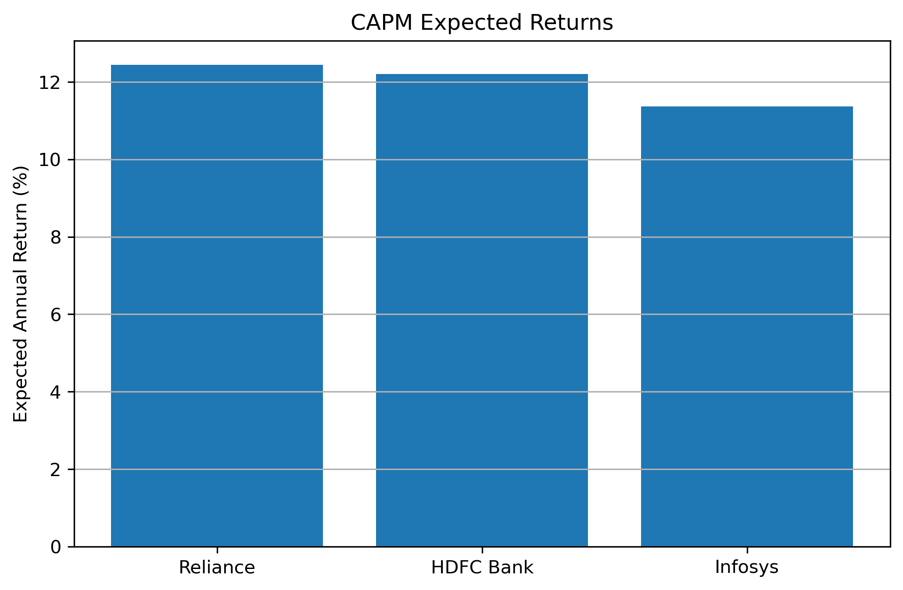
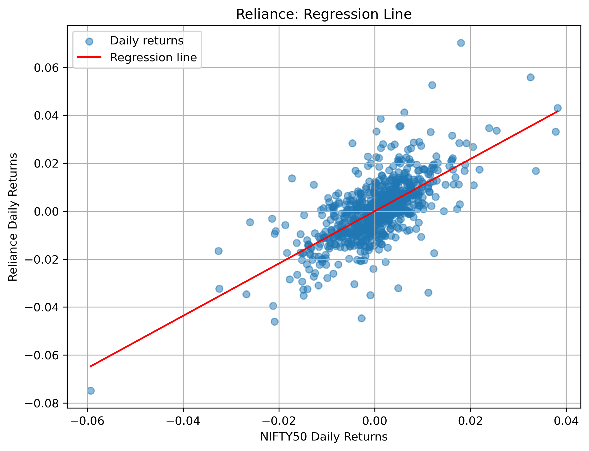

# CAPM Beta Estimation with Gradient Descent

This is a learning project on estimating stock beta using CAPM ideas and custom gradient descent.

The main notebook is written as a Markdown notebook so it renders normally on GitHub:

[Open the notebook](capm_beta_estimation.md)

I used Markdown instead of `.ipynb` because GitHub's notebook preview was not loading reliably.

## What This Project Does

- Downloads daily stock data using `yfinance`
- Uses adjusted close prices
- Converts prices into daily returns
- Estimates beta by fitting a line between stock returns and NIFTY50 returns
- Uses custom gradient descent for the regression
- Applies the CAPM formula to estimate expected annual return
- Saves plots and result CSV files in `outputs/`

This project does not predict stock prices or generate trading signals.

## CAPM and Beta

I estimate beta using the Security Characteristic Line:

$$
R_i = \alpha_i + \beta_i R_m + \epsilon_i
$$

Where:

- $R_i$ is the stock return
- $R_m$ is the market return
- $\alpha_i$ is the intercept
- $\beta_i$ is the beta
- $\epsilon_i$ is the error term

Then I use CAPM:

$$
E(R_i) = R_f + \beta_i(E(R_m) - R_f)
$$

Beta shows how much a stock moved with the market during the selected period.

## Data Used

| Asset | Ticker |
|---|---|
| Reliance Industries | `RELIANCE.NS` |
| HDFC Bank | `HDFCBANK.NS` |
| Infosys | `INFY.NS` |
| NIFTY50 | `^NSEI` |

Date range:

`2023-05-20` to `2026-05-20`

NIFTY50 is used as the market proxy.

## Results

CAPM assumptions:

- Risk-free rate: 7.12%
- Expected market return: 12%

| Stock | Alpha | Beta | $R^2$ | MAE | RMSE | Final Cost | CAPM Expected Return |
|---|---:|---:|---:|---:|---:|---:|---:|
| Reliance | -0.000066 | 1.090662 | 0.461764 | 0.006937 | 0.009673 | 0.000047 | 12.44% |
| HDFC Bank | -0.000387 | 1.040556 | 0.479111 | 0.006425 | 0.008913 | 0.000040 | 12.20% |
| Infosys | -0.000200 | 0.870702 | 0.210132 | 0.009910 | 0.013867 | 0.000096 | 11.37% |

## Plots






More plots are available in `outputs/plots/`.

## Outputs

Saved result files:

- `outputs/results/adjusted_close_prices.csv`
- `outputs/results/daily_returns.csv`
- `outputs/results/regression_results.csv`
- `outputs/results/capm_expected_returns.csv`

## Limitations

- Beta is based on historical returns and can change later.
- CAPM is a simple one-factor model.
- NIFTY50 is only a proxy for the market.
- The expected return depends on the risk-free rate and expected market return assumptions.
- This is not investment advice.

## How to Use

Install the libraries:

```bash
pip install -r requirements.txt
```

Read the notebook here:

[capm_beta_estimation.md](capm_beta_estimation.md)

## Folder Structure

```text
.
|-- README.md
|-- capm_beta_estimation.md
|-- requirements.txt
|-- outputs/
|   |-- plots/
|   `-- results/
`-- .gitignore
```
